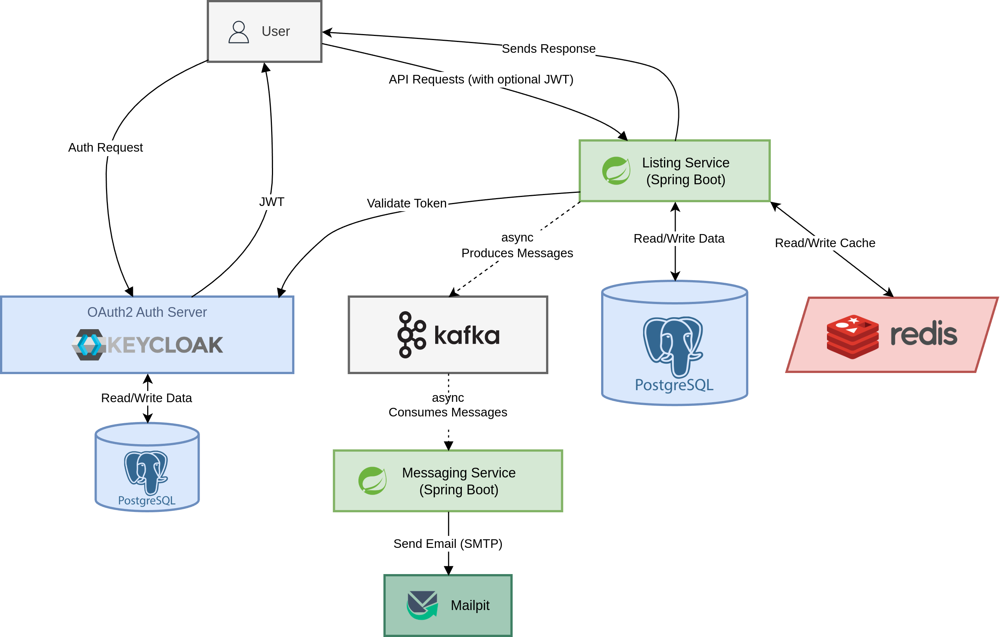
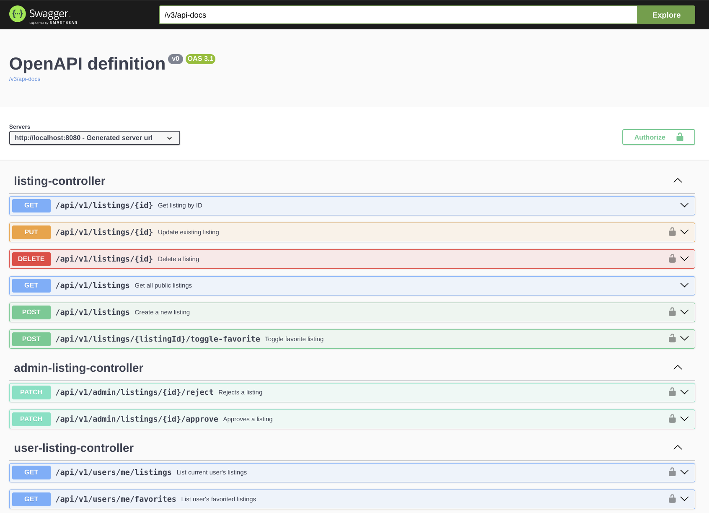

# Listing Service

Event-driven microservice handling CRUD operations for listings, integrated with Kafka, Redis, Keycloak, and
PostgreSQL. This service demonstrates modern microservice patterns, event-driven architecture, and secure API design.

## 🏗️ Architecture Overview

This high-level diagram shows how the main components of the system interact, including authentication, event flow, and
data storage.

The diagram summarizes the interaction between:

- **Listing Service** (Spring Boot) – handles CRUD APIs, persists data in PostgreSQL, and publishes events
- **Messaging Service** (Spring Boot) – consumes Kafka events to send notifications
- **Kafka** – event-driven messaging
- **Redis** – caching layer
- **Keycloak** – authentication and authorization (uses separate PostgreSQL instance)

### 🔍 Explore Detailed Flows

For **detailed system flows, sequence diagrams, and design decisions**,
see [Event Flows](./docs/flows.md).

## 🛠️ Technology Stack

- **Spring Boot 3** – microservice framework
- **PostgreSQL** – relational database
- **Kafka** – event-driven messaging
- **Redis** – caching layer
- **Testcontainers** – local integration tests (Postgres, Redis)
- **JUnit + Mockito** – unit & integration testing
- **Picocli** – CLI command support (e.g. `DisableListingsCommand`)
- **Lombok** – reduce boilerplate in DTOs / entities
- **MapStruct** – clean DTO ↔ Entity mapping
- **Keycloak** – OAuth2 / OpenID Connect authentication

## 🎨 Design Decisions

- **Event-driven architecture (Kafka)**: Enables decoupling of services via events (e.g., `ListingStatusChangedEvent`),
  improving scalability and reusability.
- **Redis**: Caching layer for listings → faster retrieval and performance.
- **JPA/Hibernate**: Clean DB mapping and entity management.
- **Keycloak**: OAuth2 Resource Server → secure integration with Spring Security.

## ⚡ Features & API Highlights

- **CRUD Listings** with role-based access, e.g.:
    - POST `/api/v1/listings` → create listing (`status=PENDING`)
    - PATCH `/api/v1/admin/listings/{id}/approve|reject` → Admin approval/rejection
    - GET `/api/v1/listings/{id}` → retrieve single listing, uses Redis cache
    - GET `/api/v1/listings` → show listings with pagination, filtering, sorting, and flexible query parameters

- **Event-driven Notifications**:
    - Messaging Service consumes Kafka events to send notification emails.

- **Flexible Responses**:
    - Logged-in users see `isFavorite` field, anonymous users don’t.

- **Pagination & Filtering**:
    - Flexible listing queries with pagination and filter parameters.

- **CLI Commands (Picocli)**:
    - Provides convenient commands for batch operations, e.g., disabling old listings.

- **Swagger UI / API documentation**
  

## 🔄 CI/CD

This project uses **GitHub Actions** for continuous integration (and deployment):

- **Build Job:** Compiles the application and creates a JAR artifact
- **Tests Job:** Runs automated Maven tests with test profile
- **Docker Job:** Builds and pushes Docker images for release tags
- **Deploy Job:** (Dummy for local k3s) Simulates deployment to local Kubernetes cluster

For more details, check `.github/workflows/ci-cd.yaml`.

## ⚙️ Installation & Setup

See [`INSTALL.md`](./INSTALL.md) for installation instructions

## 🔍 Learnings & Future Improvements

- **Rate Limiting**: Not implemented in the service; depending on requirements, it could be handled in Java (e.g., using
  Bucket4J) or at the infrastructure level, for example
  with [Traefik RateLimit middleware](https://doc.traefik.io/traefik/reference/routing-configuration/http/middlewares/ratelimit/).
- **Data Model Improvements**: `City` is currently a plain string → could become an entity with geo-coordinates for
  PostGIS queries.
- **Event-driven architecture**: Good demonstration of decoupling, but further enhancements possible with more
  microservices.
