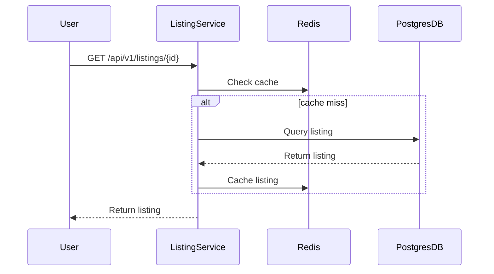
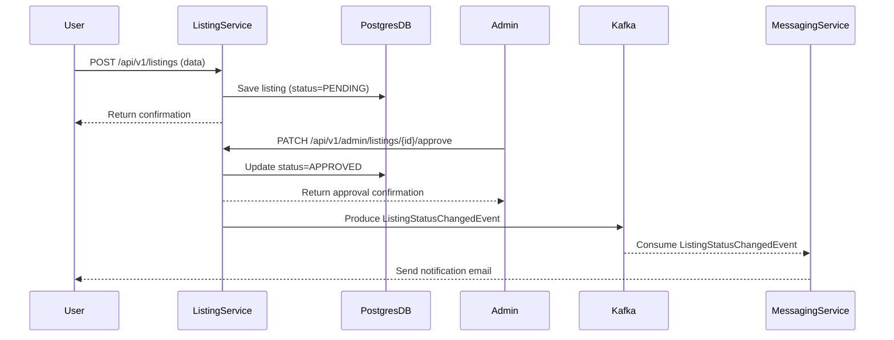

# Listing & Messaging Microservices – Event Flows

This document provides **detailed event and system flows** for the Listing and Messaging microservices.

## Listing Retrieval Flow

Shows how the Listing Service first checks Redis for cached data before querying Postgres — ensuring fast and efficient
retrieval of listing details.

## Listing Creation & Approval Flow

Demonstrates how a new listing is created and approved by an admin.
Once approved, the service publishes a Kafka event consumed by the Messaging Service to trigger a notification email.

